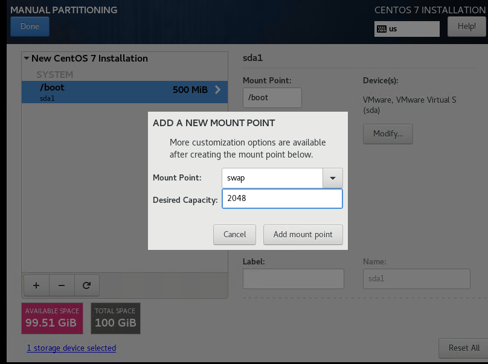

# CentOS  Tutorial

## Introduce
CentOS 是一个基于Red Hat Linux 提供的可自由使用源代码的企业级Linux发行版本。

Home:http://www.centos.org
## Download
- 当前最新版本下载地址：https://www.centos.org/download/
- 档案版本下载地址：http://wiki.centos.org/Download

本文基于 `7.6.xxx` 版本，ISO镜像下载地址：http://isoredirect.centos.org/centos/7/isos/x86_64/CentOS-7-x86_64-DVD-1810.iso
## Installation Steps
1. 开机启动界面

2. 选择安装语言,默认English，English(United States)，点击Continue继续： 

  

3. 选择安装时间`LOCALIZATION -> DATE&TIME`，设置为`Asia/Shanghai`亚洲/上海

  

4. 选择系统安装位置`SYSTEM -> INSTALLATION DESTINATION`，配置分区

  

   - 4.1 新建`/boot`：`500MB`
   
    
   - 4.2 新建`swap`：`2GB`(当前内存的2倍)
   
    
   - 4.3 新建 `/`: `空` (自动分配所有剩余空间）  
   
    
5. 选择配置ip地址 `NETWORK & HOSTNAME`

  

6. 开始安装，安装过程中选择`USER SETTINGS -> ROOT PASSWORD`设置root密码

  

7. 完成安装

## Settings

## Keymap

#### 文件与目录操作
+ cd ..                     返回上一级目录
+ cd ../..                  返回上两级目录
+ cp file1 file2            将file1复制为file2
+ cp -a dir1 dir2           复制一个目录
+ cp -a /tmp/dir1 .         复制一个目录到当前工作目录（.代表当前目录）
+ ls                       查看目录中的文件
+ ls -a                    显示隐藏文件
+ pwd                      显示工作路径
+ mkdir dir1               创建文件夹
+ mkdir -p /tmp/dir1/dir2  创建一个目录树
+ mv dir1 dir2             移动/重命名一个目录
+ rm -f file1              删除 ‘file1’
+ rm -rf dir1              删除 ‘dir1’ 目录及其子目录内容

#### 查看文件内容
+ cat file1                从第一个字节开始正向查看文件的内容
+ head -2 file1            查看一个文件的前两行
#### 文本内容处理
+ grep str /tmp/test       在文件 ‘/tmp/test’ 中查找 “str”
+ grep ^str /tmp/test      在文件 ‘/tmp/test’ 中查找以 “str” 开始的行
+ diff file1 file2         找出两个文件的不同处
+ vi file                  编辑文件
    + i     	进入编辑文本模式
    + Esc       退出编辑文本模式
    + :w        保存当前修改
    + :q        不保存退出vi
    + :wq       保存当前修改并退出vi
#### 压缩、解压
+ bzip2 file1               压缩 file1
+ bunzip2 file1.bz2         解压 file1.bz2
+ unzip file1.zip           解压一个zip格式的压缩包到当前目录
+ unzip test.zip -d /tmp/   解压一个zip格式的压缩包到 /tmp 目录
#### 系统相关
+ shutdown -h now           关机
+ shutdown -r now           重启

## Rources
+ https://www.osyunwei.com/archives/7829.html
