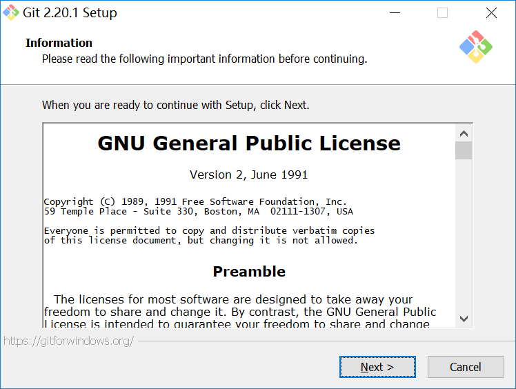
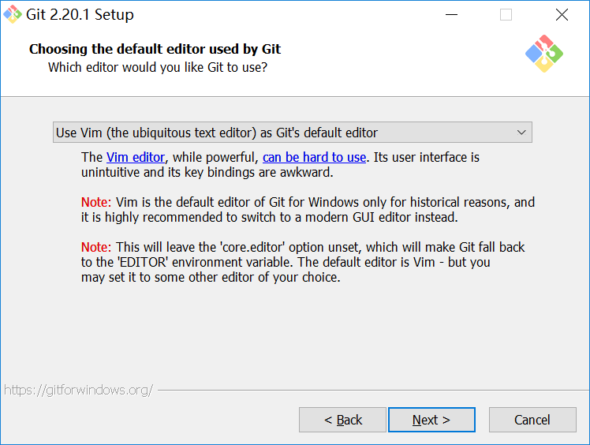
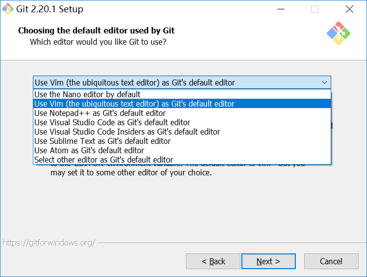
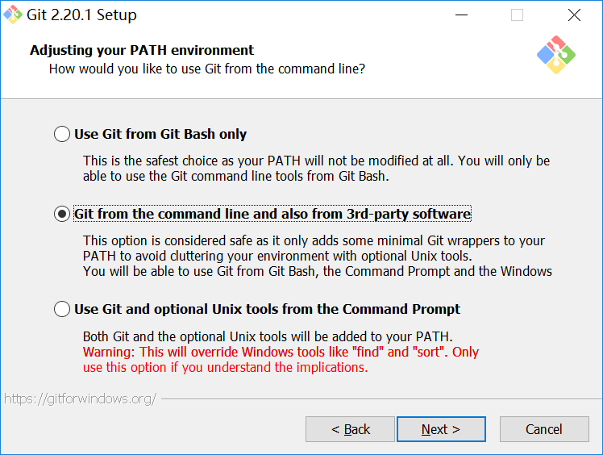
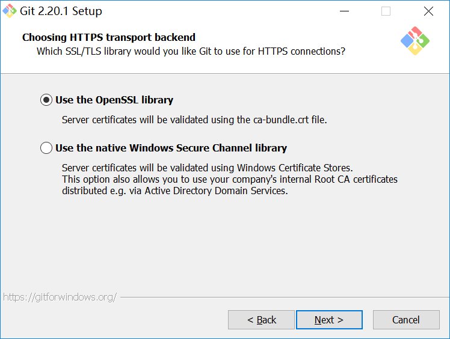
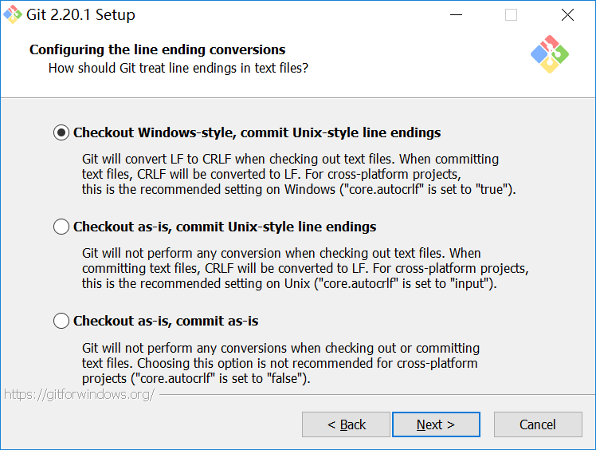
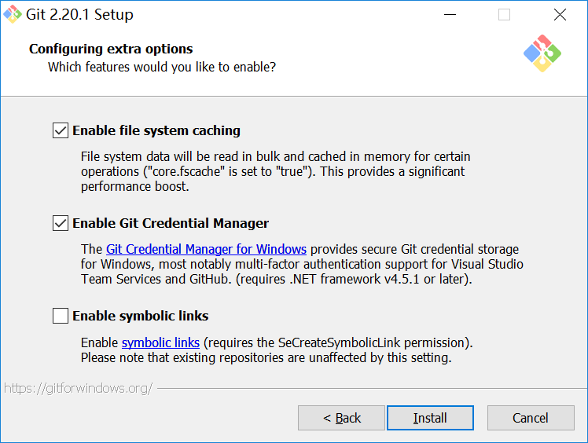
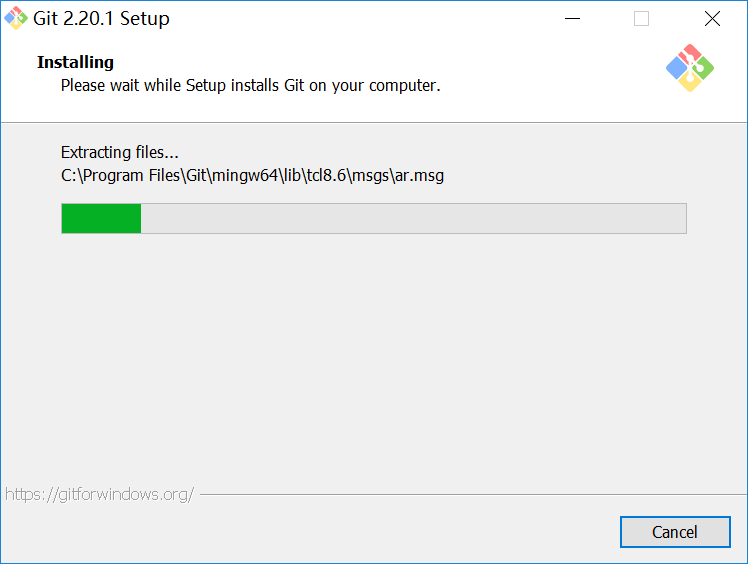
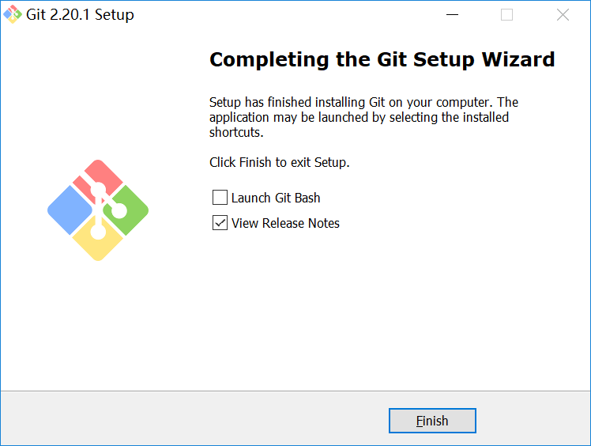

# Git Tutorial

## Introduce
Git is a free and open source distributed version control system designed to handle everything from small to very large project with speed and efficiency。

Home：https://git-scm.com/
## Download
最新版本下载：https://git-scm.com/download/win  本文基于`v2.20.1`版本，推荐使用64-bit Git for Windows

https://github.com/git-for-windows/git/releases/download/v2.20.1.windows.1/Git-2.20.1-64-bit.exe

因github.com下载速度慢，请使用淘宝镜像下载
- 官方下载地址：https://github.com/git-for-windows/git/releases/
- 淘宝镜像地址：https://npm.taobao.org/mirrors/git-for-windows

## Installation Steps
1.Information

2.select Components

- Windows Explorer integration（Windows资源管理器集成鼠标右键菜单）
  - Git Bash Here 是Git的命令行窗口
  - Git GUI Here 是图形化的管理界面
- Git LFS(Large File Support)（大文件支持）
- Associate .git* configuration files with the default text editor（将 .git 配置文件与默认文本编辑器相关联）
- Associate .sh files to be run with Bash （将.sh文件关联到Bash运行）
- Use a TrueType font in all console windows (在所有控制台窗口中使用TrueType字体)
- Check daily for Git For Windows updates (每天检查Git是否有Windows更新)

3.Select Start Menu Folder

4.Choosing the default editor used by Git (选择Git使用的默认编辑器)

- Use the Nano editor by default （默认使用 Nano 编辑器）
- **Use Vim(the ubiquitous text editor)as Git's default editor** （使用 Vim 作为 Git 的默认编辑器）
- Use Notepad++ as Git's default editor （使用 Notepad++ 作为 Git 的默认编辑器）
- Use Visual Studio Code as Git's default editor （使用 Visual Studio Code 作为 Git 的默认编辑器）
- Use Visual Studio Code Insiders as Git's default editor 
- Use Sublime Text as Git's default editor
- Use Atom as Git's default editor
- Select other editor as Git's default editor

5.Adjusting your PATH environment （配置PATH环境变量）

- Use Git from Git Bash only (只通过Git Bash来使用Git，不修改系统变量)
- **Git from the command line and also from 3rd-party software** （从Git Bash 和Windows 命令提示符中使用git，只向PATH添加一些最小的Git包，以避免使用可选的Unix工具混淆环境。默认选项）
- Use Git and optional Unix tools from the Command Prompt（git和可选的Unix工具都将添加到PATH系统变量中，警告：此操作会覆盖Windows工具，如find和sort，只有在了解其含义后才使用此选项，强烈不建议选择此项）

6.Choosing HTTPS transport backend （连接HTTPS连接使用的库）

- **Use the OpenSSL library** （使用OpenSSL库；服务器证书将使用ca-bundle.crt文件进行验证）
- Use the native Windows Secure Channel library（使用本地Windows安全通道库；服务器证书将使用Windows证书存储验证。此选项还允许您使用公司的内部根CA证书，例如，通过Active Directory Domain Services）

7.Configuring the line ending conversions （配置txt文件的末行转换方式）

- **Checkout Windows-style,commit Unix-style line endings** （在检出文本文件时，Git会将LF转换为CRLF。当提交文本文件时，CRLF将转换为LF。 对于跨平台项目，这是Windows上推荐的设置（“core.autocrlf”设置为“true”））
- Checkout as-is,commit Unix-style line endings （在检出文本文件时，Git不会执行任何转换。 提交文本文件时，CRLF将转换为LF。 对于跨平台项目，这是Unix上的推荐设置 （“core.autocrlf”设置为“input”））
- Checkout as-is,commit as-is （在检出或提交文本文件时，Git不会执行任何转换。对于跨平台项目，不推荐使用此选项（“core.autocrlf”设置为“false”））

8.Configuring the terminal emulator to use with Git Bash （选择终端程序，）

- **Use MinTTY(the default terminal of MSYS2)** （Git Bash将使用MinTTY作为终端模拟器，该模拟器具有可调整大小的窗口，非矩形选区和Unicode字体。 Windows控制台程序（如交互式Python）必须通过'winpty'启动才能在MinTTY中运行。）
- Use Windows' default console window （Git将使用Windows的默认控制台窗口（“cmd.exe”），该窗口可以与Win32控制台程序（如交互式Python或node.js）一起使用，但默认的回滚非常有限，需要配置为使用unicode 字体以正确显示非ASCII字符，并且在Windows 10之前，其窗口不能自由调整大小，并且只允许矩形文本选择。）

9.Configuring extra options （配置额外的选项）

- **Enable file system caching** （启用文件系统缓存，文件系统数据将被批量读取并缓存在内存中用于某些操作（“core.fscache”设置为“true”）。 这提供了显着的性能提升。）
- **Enable Git Credential Manager** （启用Git凭证管理器，Windows的Git凭证管理器为Windows提供安全的Git凭证存储，最显着的是对Visual Studio Team Services和GitHub的多因素身份验证支持。 （需要.NET Framework v4.5.1或更高版本）。）
- Enable symbolic links （启用符号链接，启用符号链接（需要SeCreateSymbolicLink权限）。请注意，现有存储库不受此设置的影响。）

## Settings

## Resource
- 官方书籍《Pro Git》（中文版）： https://git-scm.com/book/zh/v2
- https://github.com/xiezongnan/Summarize/blob/master/git/Git_Setup.md
