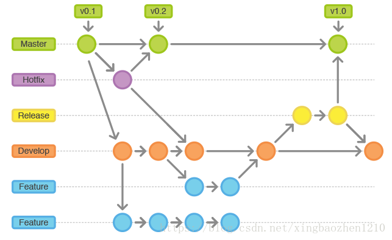

# GitFlow详解教程

Git主要优点有
- 分布式存储 , 本地仓库包含了远程仓库的所有内容 . 安全性高 , 远程仓库文件丢失了也不怕
- 优秀的分支模型 , 创建/合并分支非常的方便
- 方便快速 , 由于代码本地都有存储 , 所以从远程拉取和分支合并时都非常快捷

当分支过多时 , 如何管理这些分支呢 ? 我们团队采用了Git Flow的模式

## GitFlow 分支模型
2010年1月5日，荷兰人Vincent Driessen (@nvie，gitflow的提出者)发布了[A successful Git branching model](http://nvie.com/posts/a-successful-git-branching-model/)

>**`注意：它只是一个模型，而不是一个工具；你可以用工具去应用这个模型，也可以用最朴实的命令行。所以，重要的是理解概念，不要执着于实行的手段。`**

Git Flow就是给原本普普通通的分支赋予不同的“职责”
- `master`（蓝色）：最为稳定功能最为完整的随时可发布的代码。只有1个
- `hotfix`（红色）：修复线上代码的bug。采用issue编号或bug性质等命名，`hotfix_<版本号>_<问题描述>`，示例：hotfix_v1.0.0_username_not_support_chinese
- `develop`（黄色）：永远是功能最新最全的分支，只有1个。
- `feature`（玫红）：某个功能点正在开发阶段。按照功能点（而不是需求）命名，`feature_<版本号>_<功能名>`，示例：feature_v1.0.0_login
- `release`（绿色）：发布定期要上线的功能。用发布时间命名，可以加上适当的前缀，`release_<版本号>`，示例：release_v1.0.0

## GitFlow分支说明
### `master`
- 主分支 , 产品的功能全部实现后 , 最终在master分支对外发布
- 该分支为只读唯一分支 , 只能从其他分支(release/hotfix)合并 , 不能在此分支修改
- 另外所有在master分支的推送应该打标签做记录,方便追溯
- 例如release合并到master , 或hotfix合并到master

### `develop`
- 主开发分支 , 基于master分支克隆
- 包含所有要发布到下一个release的代码
- 该分支为只读唯一分支 , 只能从其他分支合并
- feature功能分支完成 , 合并到develop(不推送)
- develop拉取release分支 , 提测
- release/hotfix 分支上线完毕 , 合并到develop并推送

### `feature`
- 功能开发分支 , 基于develop分支克隆 , 主要用于新需求新功能的开发
- 功能开发完毕后合到develop分支(未正式上线之前不推送到远程中央仓库!!!)
- feature分支可同时存在多个 , 用于团队中多个功能同时开发 , 属于临时分支 , 功能完成后可选删除

### `release`
- 测试分支 , 基于feature分支合并到develop之后  , 从develop分支克隆
- 主要用于提交给测试人员进行功能测试 , 测试过程中发现的BUG在本分支进行修复 , 修复完成上线后合并到develop/master分支并推送(完成功能) , 打Tag
- 属于临时分支 , 功能上线后可选删除

### `hotfix`
- 补丁分支 , 基于master分支克隆 , 主要用于对线上的版本进行BUG修复
- 修复完毕后合并到develop/master分支并推送 , 打Tag
- 属于临时分支 , 补丁修复上线后可选删除
- 所有hotfix分支的修改会进入到下一个release

## 主要工作流程

1. 初始化项目为gitflow , 默认创建master分支 , 然后从master拉取第一个develop分支

2. 从develop拉取feature分支进行编码开发(多个开发人员拉取多个feature同时进行并行开发 , 互不影响)

3. feature分支完成后 , 合并到develop(不推送 , feature功能完成还未提测 , 推送后会影响其他功能分支的开发)合并feature到develop , 可以选择删除当前feature , 也可以不删除 . 但当前feature就不可更改了 , 必须从release分支继续编码修改

4. 从develop拉取release分支进行提测 , 提测过程中在release分支上修改BUG

5. release分支上线后 , 合并release分支到develop/master并推送合并之后 , 可选删除当前release分支 , 若不删除 , 则当前release不可修改 . 线上有问题也必须从master拉取hotfix分支进行修改

6. 上线之后若发现线上BUG , 从master拉取hotfix进行BUG修改

7. hotfix通过测试上线后 , 合并hotfix分支到develop/master并推送合并之后 , 可选删除当前hostfix , 若不删除 , 则当前hotfix不可修改 , 若补丁未修复 , 需要从master拉取新的hotfix继续修改

8. 当进行一个feature时 , 若develop分支有变动 , 如其他开发人员完成功能并上线 , 则需要将完成的功能合并到自己分支上即合并develop到当前feature分支

9. 当进行一个release分支时 , 若develop分支有变动 , 如其他开发人员完成功能并上线 , 则需要将完成的功能合并到自己分支上即合并develop到当前release分支 (!!! 因为当前release分支通过测试后会发布到线上 , 如果不合并最新的develop分支 , 就会发生丢代码的情况)

>**`下图是引自大神的Git Flow 工作流程图`**

--------------------- 
作者：BlueKitty1210 
来源：CSDN 
原文：https://blog.csdn.net/xingbaozhen1210/article/details/81386269 
版权声明：本文为博主原创文章，转载请附上博文链接！

## Resource

- [GitLab 工作流介绍（GitLab Flow）](https://blog.csdn.net/henryhu712/article/details/82284702)
- [GitFlow简介](https://blog.csdn.net/qq_21397217/article/details/90080766)
- [团队中的 Git 实践](https://ourai.ws/posts/working-with-git-in-team/)
- [Gitflow Workflow](https://www.atlassian.com/git/tutorials/comparing-workflows/gitflow-workflow)
- https://github.com/xirong/my-git/blob/master/git-workflow-tutorial.md
- https://www.oschina.net/translate/a-successful-git-branching-model
- https://www.oschina.net/translate/why-arent-you-using-git-flow
- [一个成功的Git分支模型](https://blog.csdn.net/dbzhang800/article/details/6798724)
- https://blog.csdn.net/qq_21397217/article/details/90080766
- https://www.cnblogs.com/wish123/p/9785101.html
- http://www.berlinix.com/it/gitflow.php
- https://blog.csdn.net/qq_34642668/article/details/80728970