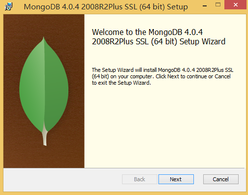
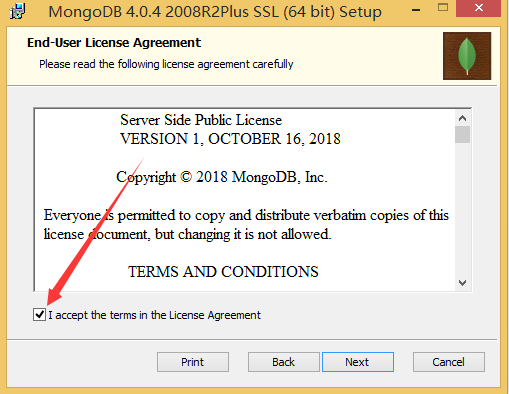
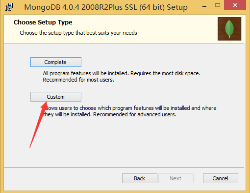
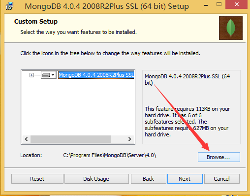
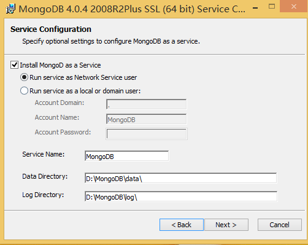
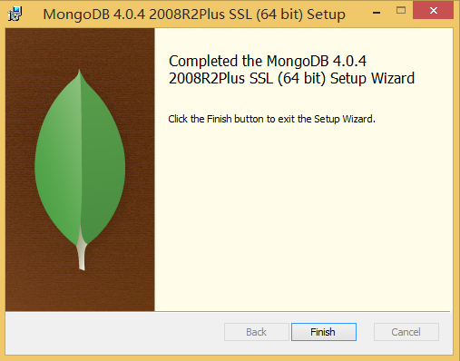
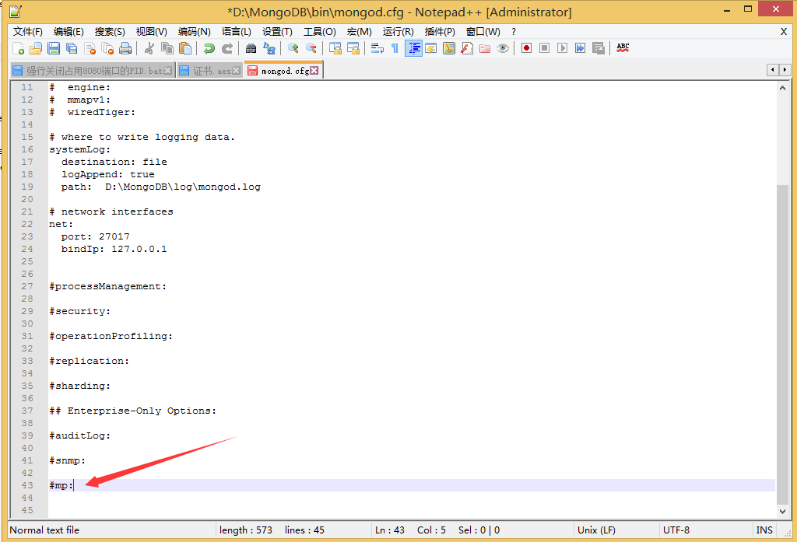

# MongoDB for Windows Tutorial

## Download
本文基于`v4.0.4`版本，下载地址
https://fastdl.mongodb.org/win32/mongodb-win32-x86_64-2008plus-ssl-4.0.4-signed.msi
## Installation Steps

- 1.下载安装包后，双击进行安装，点击next

  

- 2.选择I accept the terms in the License Agreement 后点击next
  
  

- 3.选择安装目录，点击Custom，默认安装在C:/Program Files/MongoDB/Server

  
  
  点击Browse...选择安装目录
  
  

- 4.这里安装在D:/MongoDB目录下，点击next

  

- 5.点击next

  

- 6.点击next后，出现安装界面，点击Install进行安装

  

- 7.完成安装 

  
 
 - 8.验证

 打开浏览器，在浏览器中输入`http://localhost:27017/`查看，显示如下内容表示连接成功。
```
It looks like you are trying to access MongoDB over HTTP on the native driver port.
```
## Settings

- 默认安装目录为：C:/Program Files/MongoDB/Server/4.0
- 默认`Data Directory`：D:/MongoDB/Data/
- 默认`Log Directory`：D:/MongoDB/log/

1.修改存储数据库文件路径
  - 在 `Data Directory` 中创建db文件夹
  - 修改安装目录 `bin/mongod.cfg` 文件
```tcl
# mongod.conf

# for documentation of all options, see:
#   http://docs.mongodb.org/manual/reference/configuration-options/

# where to write logging data.
storage:
  dbPath: D:\MongoDB\data\db  # 绑定数据库文件存储路径，默认值为Data Directory所指定的路径
  journal:
    enabled: true   # 启用日志文件，默认启动

 # where to write logging data.
systemLog:
  destination: file
  logAppend: true     # 错误日志采用追加模式
  path:  D:\Program Files\MongoDB\Server\4.0\log\mongod.log  # 日志文件

# network interfaces
net:
  port: 27017         # 绑定服务端口，默认端口27017
  bindIp: 127.0.0.1   # 绑定服务IP，若绑定127.0.0.1，则只能本机访问，不指定默认本地所有IP
```
其他参数含义：
  ```tcl
   参数 　　　　　　　　　　　描述
 logpath              #定MongoDB日志文件，注意是指定文件不是目录
 logappend            #使用追加的方式写日志
 serviceName          #指定服务名称
 serviceDisplayName   #指定服务名称，有多个mongodb服务时执行。
 install              #指定作为一个Windows服务安装。
  ```
2.数据库服务安装在`其他盘符（非C:/）`下，删除`bin/mongod.cfg`文件中的`mp:`参数（一般出现在最后一行），否则会出现启动错误

   

3.手动根据配置文件创建windows服务
管理员模式cmd先跳转到d:\mongodb\bin目录下。输入如下命令才能创建服务。
```tcl
mongod --config "D:\mongodb\mongo.config" --install --serviceName "MongoDB"
# sc方式
sc create MongoDB binPath= "d:\mongodb\bin\mongod.exe --service --config=d:\mongodb\mongo.config"
```

## Command  
  + net start MongoDB        启动MongoDB服务
  + net stop MongoDB         关闭MongoDB服务
  + net restart MongoDB      重启MongoDB服务


## Keymap