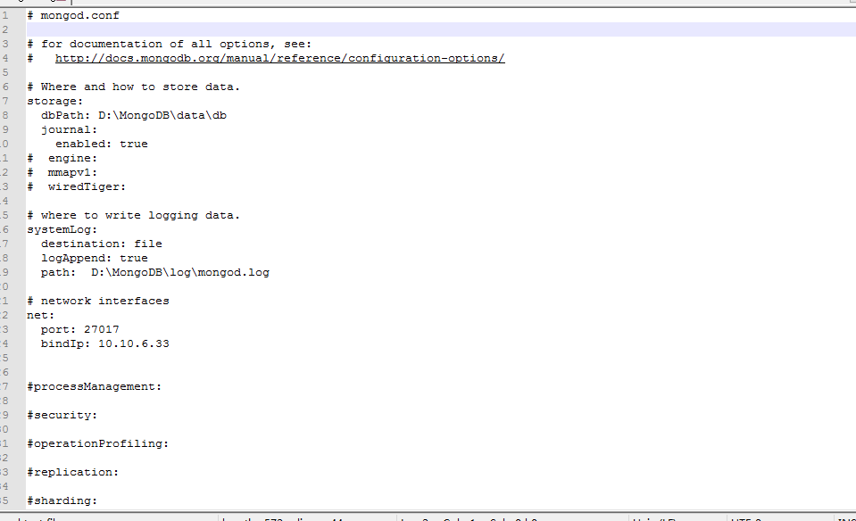
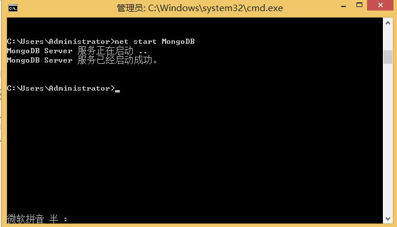

# MongoDB Tutorial

## Introduce

Home: https://www.mongodb.com/
## Download
https://www.mongodb.com/download-center/community

本文基于`v4.0.4`版本，下载地址
https://fastdl.mongodb.org/win32/mongodb-win32-x86_64-2008plus-ssl-4.0.4-signed.msi
## Installation Steps

- 1.下载安装包后，双击进行安装，点击next

  

- 2.选择I accept the terms in the License Agreement 后点击下一步
  
  

- 3.选择安装目录，点击Custom，默认安装在C:/Program Files/MongoDB/Server

  
  
  点击Browse...选择安装目录
  
  

- 4.这里安装在D:/MongoDB目录下，点击next

  

- 5.完成安装

## Settings

在安装目录中data新建db文件夹用于存储数据库文件

1.配置文件参数，mongod.cfg文件

  打开安装目录下的bin中的mongod.cfg文件，进行配置。
  
   参数 　　　　　　　　　　　描述
    
+ --bind_ip　　 　　　　　　绑定服务IP，若绑定127.0.0.1，则只能本机访问，不指定默认本地所有IP
+ --logpath 　　　　　　　　定MongoDB日志文件，注意是指定文件不是目录
+ --logappend 　　 　　　　使用追加的方式写日志
+ --dbpath 　　　　　　　　 指定数据库路径
+ --port 　　　　　 　　　　指定服务端口号，默认端口27017+ 
+ --serviceName    　　　　指定服务名称
+ --serviceDisplayName 　 指定服务名称，有多个mongodb服务时执行。
+ --install 　　　　　　　　指定作为一个Windows服务安装。
  
   
  

2.如果安装目录不在C盘下，一定要删除mongod.cfg文件的mp:的参数，否者会出现启动错误

   

3.配置完成后，使用管理员身份运行cmd，输入net start MongoDB 启动服务

   
  

## Resource
