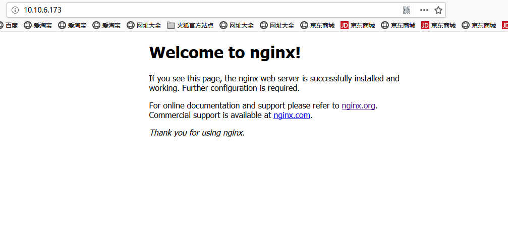

# Nginx  Tutorial

## Introduce
Nginx (engine x) 是一个高性能的HTTP和反向代理服务，也是一个IMAP/POP3/SMTP服务。

Home: http://www.nginx.org
## Download
所需环境安装：
+ PCRE库
  
  PCRE(Perl Compatible Regular Expressions) 是一个Perl库，包括 perl 兼容的正则表达式库。nginx 的 http 模块使用 pcre 来解析正则表达式，所以需要在 linux 上安装 pcre 库。
  
  本文使用的版本是pcre-8.33，其下载地址为：http://jaist.dl.sourceforge.net/project/pcre/pcre/8.33/pcre-8.33.tar.gz
  
  其它版本下载地址为：
  + https://sourceforge.net/projects/pcre/files/pcre/
  + http://jaist.dl.sourceforge.net/project/pcre/pcre/
  
  Home: http://www.pcre.org/
+ SSL库

  OpenSSL是一个强大的安全套接字层密码库，囊括主要的密码算法、常用的密钥和证书封装管理功能及SSL协议，并提供丰富的应用程序供测试或其它目的使用，nginx 不仅支持http协议，还支持https（即在ssl协议上传输http），所以需要在Centos安装OpenSSL库。
    
  本文使用的版本是openssl-1.0.1j,其下载地址为：http://www.openssl.org/source/openssl-1.0.1j.tar.gz
  
  其它版本下载地址为：https://www.openssl.org/source/
  
  Home: https://www.openssl.org/
+ zlib库
    
  zlib 库提供了很多种压缩和解压缩的方式， nginx 使用 zlib 对 http 包的内容进行 gzip ，所以需要在 Centos 上安装 zlib 库。

  本文使用的版本是zlib-1.2.11，其下载地址为：http://zlib.net/zlib-1.2.11.tar.gz
  
  其它版本下载地址为：http://www.zlib.net/fossils/
  
  Home: http://zlib.net/
   
+ Nginx下载

  本文使用的版本是nginx-1.14.2，其下载地址为：http://nginx.org/download/nginx-1.14.2.tar.gz
  
  其它版本下载地址为：http://nginx.org/download/
## Installation Steps

本文使用wget在线安装Nginx，如未安装请安装：

安装wget的指令为: `yum -y install wget`

1. 安装gcc gcc-c++(如新环境,未安装请先安装)

   指令为：`yum install -y gcc gcc-c++ `
   
2. 安装PCRE库，安装目录为：/usr/local/

   指令为:
```
 cd /usr/local                  #切换到/usr/local目录下
 wget http://jaist.dl.sourceforge.net/project/pcre/pcre/8.33/pcre-8.33.tar.gz   #使用wget在线下载安装包
 tar -zxvf pcre-8.33.tar.gz     #解压安装包
 cd pcre-8.33                   #切换到pcre-8.33目录下
 ./configure                    #使用默认配置
 make && make install           #安装
```
3. 安装SSL库，安装目录为：/usr/local/

    指令为：
```
 cd /usr/local                   #切换到/usr/local目录下
 wget http://www.openssl.org/source/openssl-1.0.1j.tar.gz    #使用wget在线下载安装包
 tar -zxvf openssl-1.0.1j.tar.gz #解压安装包
 cd openssl-1.0.1j               #切换到openssl-1.0.1j目录下
 ./config                        #使用默认配置
 make && make install            #安装
```
4. 安装zlib库，安装目录为：/usr/local/

    指令为：
```
 cd /usr/local                   #切换到/usr/local目录下
 wget http://zlib.net/zlib-1.2.11.tar.gz   #使用wget在线下载安装包
 tar -zxvf zlib-1.2.11.tar.gz    #解压安装包
 cd zlib-1.2.11                  #切换到zlib-1.2.11
 ./configure                     #使用默认配置
 make && make install            #安装
```
5. 安装Nginx，安装目录为：/usr/local/

    指令为:
```
 cd /usr/local                   #切换到/usr/local目录下
 wget http://nginx.org/download/nginx-1.14.2.tar.gz  #使用wget在线下载安装包
 tar -zxvf nginx-1.14.2.tar.gz   #解压安装包
 cd nginx-1.14.2                 #切换到ngixn-1.14.2
 ./configure --user=nobody --group=nobody --prefix=/usr/local/nginx --with-http_stub_status_module --with-http_gzip_static_module --with-http_realip_module --with-http_sub_module --with-http_ssl_module   #配置nginx
 make && make install            #安装
```
6. 启动nginx服务，切换到安装目录nginx下的sbin目录

    指令为：
```
 cd /usr/local/nginx/sbin      #切换到sbin目录下
 ./nginx                       #启动nginx
```
7. 配置防火墙或关闭防火墙后，在浏览器中输入ip+端口号即可访问到Welcomne to nginx页面，完成安装。

  
## Settings

防火墙firewall配置：

相关命令如下：
```
firewall-cmd --zone=public --add-port=80/tcp --permanent   #添加80端口
firewall-cmd --reload      #更新防火墙规则
firewall-cmd --zone=public --query-port=80/tcp    #查看端口状态
firewall-cmd --zone=public --remove-port=80/tcp --permanent    #删除开放的端口

```

## Keymap
```
在nginx安装目录sbin下执行命令：
cd /usr/local/nginx/sbin
    ./nginx            #启动nginx服务
    ./nginx -s stop    #此方式停止步骤是待nginx进程处理任务完毕进行停止。 
    ./nginx -s quit    #此方式相当于先查出nginx进程id再使用kill命令强制杀掉进程。
    ./nginx -s reload  #重新启动nginx服务
    ./nginx -v         #查看版本
    ./nginx -t         #查看nginx的配置文件
    ./nginx -h         #帮助
```
## Rources

+ https://blog.csdn.net/wxyjuly/article/details/79443432


