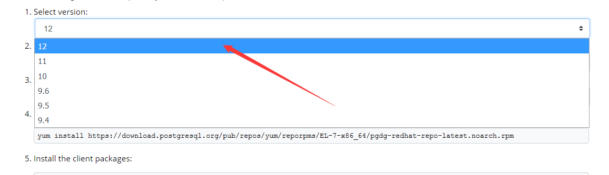
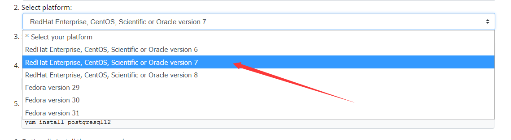
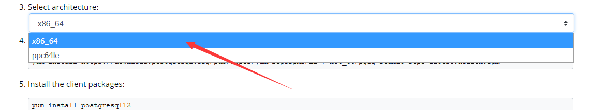
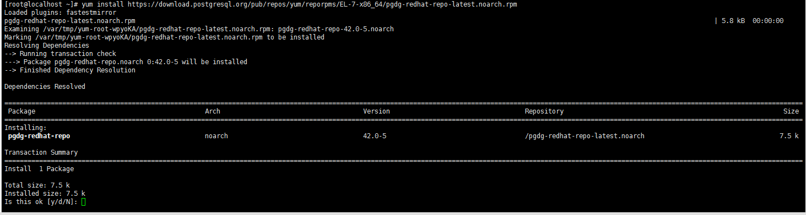
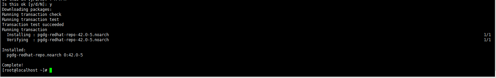
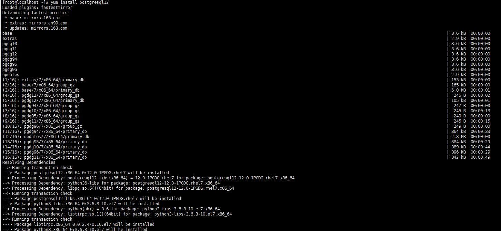
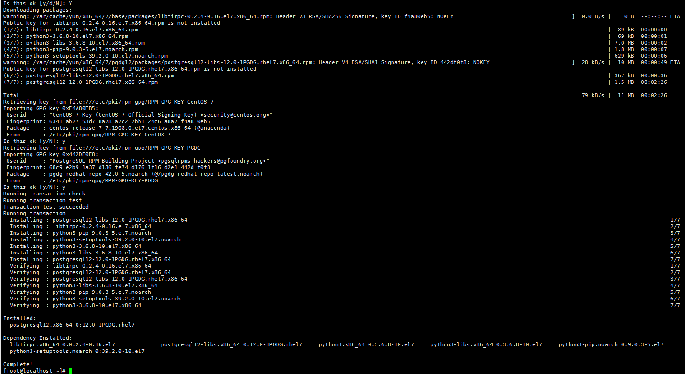
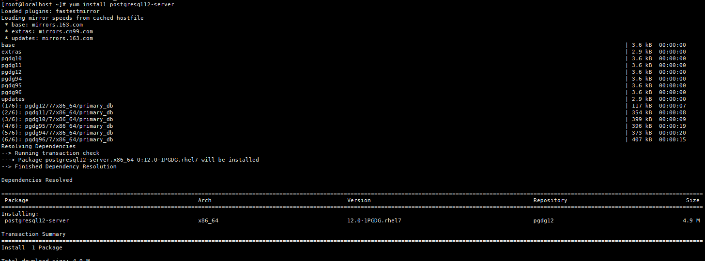
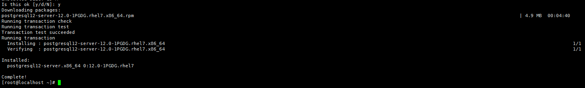
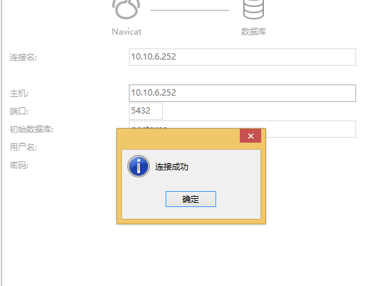

- # postgreSQL  Tutorial

  ## Introduce

  PostgreSQL是一个功能非常强大的、源代码开放的客户/服务器关系型数据库管理系统（RDBMS）。

  Home: https://www.postgresql.org/

  ## Download

  - 版本下载地址：https://www.postgresql.org/download/

  ## Installation Steps

  本文在Centos7.7中安装 postgreSQL12 版本。

  路径：https://www.postgresql.org/download/linux/redhat/

  1. Select version   选择版本
    
  2. Select platform   选择平台
    
  3. Select architecture  选择体系结构
    
  4. Install the repository RPM  安装存储库RPM

     ```
     $ yum install https://download.postgresql.org/pub/repos/yum/reporpms/EL-7-x86_64/pgdg-redhat-repo-latest.noarch.rpm
     ```
     
      输入y确认下载并安装：

      
  5. Install the client packages  安装客户端软件包

     ```
     $ yum install postgresql12
     ```
      
      输入y确认下载并安装：

      
  6. Optionally install the server packages  安装服务器包

     ```
     $ yum install postgresql12-server
     ```
      
      输入y确认下载并安装：

      
  7. rpm -aq| grep postgres  验证是否安装成功

     ```
     $ rpm -aq| grep postgres
     ```
      输出以下内容则安装成功：
      
  8. Optionally initialize the database and enable automatic start  初始化数据库并启用开机自动启动

     ```
     $ /usr/pgsql-12/bin/postgresql-12-setup initdb  #初始化数据库
     $ systemctl enable postgresql-12				#启用开机自动启动
     $ systemctl start postgresql-12					#开启服务器
     ```
     初始化数据库：
      
     启用开机自启动：
      
  9. 配置防火墙

     ```
     $ firewall-cmd --permanent --add-port=5432/tcp 
     $ firewall-cmd --permanent --add-port=80/tcp  
     $ firewall-cmd --reload 
     ```
      
  10. 修改用户密码

      ```
      $ su - postgres  切换用户，执行后提示符会变为 '-bash-4.2$'
      $ psql -U postgres 登录数据库，执行后提示符变为 'postgres=#'
      $ ALTER USER postgres WITH PASSWORD 'postgres'  设置postgres用户密码为postgres
      $ \q  退出数据库
      ```
      
  11. 开启远程访问

      ```
      $ vi /var/lib/pgsql/12/data/postgresql.conf
       修改#listen_addresses = 'localhost'  为  listen_addresses='*'
       当然，此处‘*’也可以改为任何你想开放的服务器IP
      ```
      
  12. 信任远程连接

      ```
      $ vi /var/lib/pgsql/12/data/pg_hba.conf
      修改如下内容，信任指定服务器连接
      # IPv4 local connections:
        host    all            all      127.0.0.1/32      trust
        host    all            all      10.10.6.1/24（需要连接的服务器IP）trust
      ```
      注：10.10.6.1/24 其中24意思为允许10.10.6段内的ip连接;
      

  13. 重启服务

      ```
      $ systemctl restart postgresql-12
      ```
      
  14. 使用Navicat软件连接
      


  ## Settings

  ## Keymap

  ## Command

  ## Rources

  - https://www.cnblogs.com/stulzq/p/7766409.html
