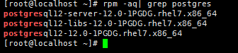
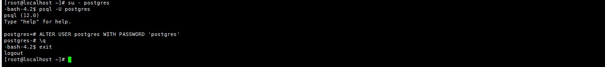

# PostgreSQL  Tutorial

## Introduce


PostgreSQL is a powerful, open source object-relational database system that uses and extends the SQL language combined with many features that safely store and scale the most complicated data workloads. The origins of PostgreSQL date back to 1986 as part of the POSTGRES project at the University of California at Berkeley and has more than 30 years of active development on the core platform.

[About - What is PostgreSQL](https://www.postgresql.org/about/)

PostgreSQL是一个功能非常强大的、源代码开放的客户/服务器关系型数据库管理系统（RDBMS）。

Home: https://www.postgresql.org/

## Download
- https://www.postgresql.org/download/
- [Installer by EnterpriseDB](https://www.enterprisedb.com/downloads/postgres-postgresql-downloads)
- [zip archive by EnterpriseDB](https://www.enterprisedb.com/download-postgresql-binaries)

### Platform support
- For Windows

|PostgreSQL Version  |	64 Bit Windows Platforms |	32 Bit Windows Platforms |
| --- | ---| ---|
|12  |	2019, 2016, 2012 R2 | 	 |
|11  |	2019, 2016, 2012 R2 |	  |
|10  |	2016, 2012 R2 & R1, 2008 R2, 7, 8, 10  | 	2008 R1, 7, 8, 10 |
|9.6 |	2012 R2 & R1, 2008 R2, 7, 8, 10 | 	2008 R1, 7, 8, 10 |
|9.5 | 	2012 R2 & R1, 2008 R2  | 	2008 R1 |
|9.4 | 	2012 R2, 2008 R2  |	2008 R1 |

## Installation Steps

在Centos7.7中安装 PostgreSQL12 版本。

采用Yum方式安装参考官方文档地址：https://www.postgresql.org/download/linux/redhat/

To use the PostgreSQL Yum Repository ,follow these steps：

1. Select version（选择版本）
  
2. Select platform（选择平台）
  
3. Select architecture（选择体系结构）
  
4. Install the repository RPM（安装存储库RPM）
    ```
    $ yum install https://download.postgresql.org/pub/repos/yum/reporpms/EL-7-x86_64/pgdg-redhat-repo-latest.noarch.rpm
    ```
  
  输入y确认下载并安装：
  

5. Install the client packages（安装客户端软件包）

  ```tcl
  $ yum install postgresql12
  ```
  
  输入y确认下载并安装：
  
6. Optionally install the server packages  安装服务器包

    ```
    $ yum install postgresql12-server
    ```
    
    输入y确认下载并安装：

    
7. rpm -aq| grep postgres  验证是否安装成功

    ```tcl
    $ rpm -aq| grep postgres
    ```
    输出以下内容则安装成功：
    
8. Optionally initialize the database and enable automatic start  初始化数据库并启用开机自动启动

    ```
    $ /usr/pgsql-12/bin/postgresql-12-setup initdb  #初始化数据库
    $ systemctl enable postgresql-12				#启用开机自动启动
    $ systemctl start postgresql-12					#开启服务器
    ```
    初始化数据库：
    
    启用开机自启动：
    
9. 配置防火墙

    ```
    $ firewall-cmd --permanent --add-port=5432/tcp 
    $ firewall-cmd --permanent --add-port=80/tcp  
    $ firewall-cmd --reload 
    ```
    
10. 修改用户密码

    ```
    $ su - postgres  切换用户，执行后提示符会变为 '-bash-4.2$'
    $ psql -U postgres 登录数据库，执行后提示符变为 'postgres=#'
    $ ALTER USER postgres WITH PASSWORD 'postgres'  设置postgres用户密码为postgres
    $ \q  退出数据库
    ```
    
11. 开启远程访问

    ```
    $ vi /var/lib/pgsql/12/data/postgresql.conf
      修改#listen_addresses = 'localhost'  为  listen_addresses='*'
      当然，此处‘*’也可以改为任何你想开放的服务器IP
    ```
    
12. 信任远程连接

    ```
    $ vi /var/lib/pgsql/12/data/pg_hba.conf
    修改如下内容，信任指定服务器连接
    # IPv4 local connections:
      host    all            all      127.0.0.1/32      trust
      host    all            all      10.10.6.1/24（需要连接的服务器IP）trust
    ```
    注：10.10.6.1/24 其中24意思为允许10.10.6段内的ip连接;

    

13. 重启服务

    ```
    $ systemctl restart postgresql-12
    ```
    
14. 使用Navicat软件连接

    


## Settings

## Keymap
## Command

## Rources
- https://www.oschina.net/news/103267/postgresql-is-the-dbms-of-the-year-2018
- https://www.cnblogs.com/stulzq/p/7766409.html
