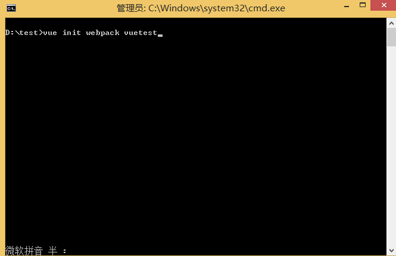
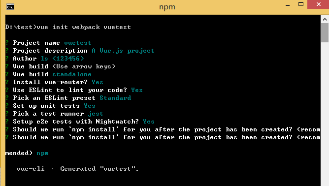
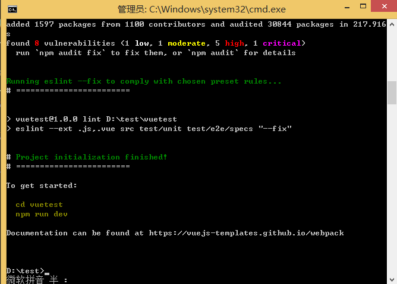
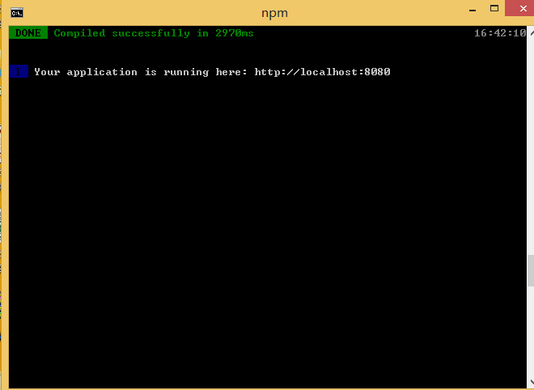

# vue  Tutorial

## Introduce

https://cn.vuejs.org/
## Download

## Installation Steps

### 前置条件
```tcl
#安装node.js  v10.13.0
#安装npm  v6.4.1
```
### 安装组件
```tcl
#全局安装webpack  
     npm install webpack -g
#安装vue  v2.9.6
     npm install vue    ##安装最新版本的vue
     npm install vue@(版本号)   ##安装指定版本的vue
#安装vue脚手架 vue-cli
     npm install vue-cli  
```

- vue-router：一般单页面应用SPA都要用到的前端路由
- vuex：一个转为vue.js应用程序开发的状态管理模式

 ### 创建项目
 1. 项目基本信息
 ```tcl
# 项目名称： vuedemo
# 项目根目录：D:/vuedemo/
 ```

2. 使用webpack模板创建项目，在项目根目录中打开命令窗口并执行以下命令：
```tcl
vue init webpack <projectName>         ## projectName为项目名
```     
   
   
   创建过程中需要进行一些配置，默认回车即可
   
   
   
   其中：
   - Project name (projectName)     ##项目名称
   - Project description (A Vue.js project) ## 项目描述
   - Author ##作者
   - Install vue-router?            ##是否安装路由vue-router默认选中yes
   - Use ESLint to lint your code ？##是否使用语法检查ESLint管理你的代码默认选择yes
   - Pick an ESLint preset (Use arrow keys) ##选择一个预置ESLint（使用箭头键）
   - Setup unit tests with Karma + Mocha? (Y/n) ##是否安装单元测试，自己选择
   - Setup e2e tests with Nightwatch(Y/n)? ##是否安装e2e测试 ，自己选择
           
   2. 出现如下信息，说明创建成功；
   
      
     
   3. 进入到项目的根目录中，执行npm run dev 启动vue项目
   
      cd vuetest                            ##进入到项目根目录
     
      npm run dev                           ##启动项目
     
   4. 出现如下界面说明，项目启动成功，即可在浏览器中访问
   
      


## Settings
3. 解决跨域问题

(1).新建`config/dev-host.js`,并在文件中添加后台访问地址
```js
'use strict'
module.exports={
   devApiHost:"http://10.10.6.6:88"   //后端访问地址
}
```          
(2).在`config/index.js`中进行相关配置
```js    
const devHost = require('./dev-host')
proxyTable: {
   '/': {
      target: devHost.devApiHost, // 源地址
      changeOrigin: true, // 是否跨域
      pathRewrite: {   //路径重写
      '^/': '/'
      }
   }
}
// 配置完成后，在前端页面方法中调用即可完成前后端交互
this.axios.get(api).then((response) => {
   console.log(response.data)
})
```      
4. 配置ESLint。在`.eslintrc.js`文件中的rules中配置
```js    
https://blog.csdn.net/hsl0530hsl/article/details/78594973  ##具体配置参考
使用：   "generator-star-spacing": 0       ##生成器函数*的前后空格
        "indent": ["error",2]             ##缩进风格2个空格
        "linebreak-style": [0, "windows"] ##换行风格
        "quotes": [1, "single"]           ##引号类型 ''
        "semi": [2, "always"]             ##语句强制分号结尾
```

## 组件的安装与设置
- **`安装Element-UI插件及设置`**

```tcl
# npm install element-ui -S
```
在 `src/main.js`文件中引入
```javascript
import ElementUI from 'element-ui'
import 'element-ui/lib/theme-chalk/index.css'

Vue.use(ElementUI)
```
- **`安装axios插件及设置`**

组件主页：https://github.com/axios/axios
```tcl
# npm install -g --save axios vue-axios 
```
在 `src/main.js` 文件中引入
```javascript
import axios from 'axios'
import VueAxios from 'vue-axios'
//Vue.use(VueAxios, axios)
Vue.prototype.$axios = axios // 全局注册，使用方法为：this.$axios
```
- **`安装qs插件及设置`**

组件主页：https://github.com/ljharb/qs
```tcl
# npm install -g -S qs.js
```
在 `src/main.js` 文件中引入
```JavaScript
import qs from 'qs' // 能把json格式的直接转成data所需的格式

Vue.prototype.qs = qs // 全局注册，使用方法为：this.qs
```
- **`安装crypto-js组件及设置`**

JavaScript library of crypto standards. Github：https://github.com/brix/crypto-js
```tcl
# npm install -g crypto-js
```
在 vue文件中引入
```js
import CryptoJS from 'crypto-js'

const key CryptoJS.enc.Utf8.parse('123456')
```
- **`安装NProgress加载进度条组件及设置`**

NProgress是页面跳转时出现在浏览器顶部的进度条组件

组件主页：http://ricostacruz.com/nprogress/  
Github主页：https://github.com/rstacruz/nprogress
```tcl
# npm install -g nprogress --save
```
在 `src/routes.js` 或 `src/main.js`文件中引入
```js
// 用法
NProgress.start()
NProgress.done()

import NProgress from 'nprogress'
import 'nprogress/nprogress.css'

// 配置NProgress进度条选项  —— 动画效果
NProgress.configure({ ease: 'ease', speed: 500 })

router.beforeEach((to, from, next) => {
   NProgress.start()
   next()
})

router.afterEach(() => {
   NProgress.done()
})
```
修改NProgress颜色。在 `App.vue` 文件的 `style` 中增加
```css
#nprogress .bar {
   background: red !important; //自定义颜色
}
```

## Command 
1. 启动vue项目
```tcl
 # npm run dev
```
## 项目打包优化
项目一般使用`npm run build`命令进行项目打包
- 配置webpack
1. 配置resolve.modules
打开build/webpack.base.conf.js文件，添加modules配置
```js
module.exports = {
  resolve: {
    extensions: ['.js', '.vue', '.json'],
    modules: [
      resolve('src'),
      resolve('node_modules')
    ],
    alias: {
      'vue$': 'vue/dist/vue.esm.js',
      '@': resolve('src'),
    }
  },
}
```
2. CDN加速
在index.html中引入cdn资源
```html
<head>
  <link href="https://cdn.bootcss.com/element-ui/2.13.0/theme-chalk/index.css" rel="stylesheet">
</head>
<body>
  <script src="https://cdn.bootcss.com/vue/2.5.2/vue.min.js">
  <script src="https://cdn.bootcss.com/element-ui/2.13.0/index.js">
</body>
```
修改build/webpack.base.conf.js文件，添加externals配置。
```js
module.exports = {
  context: path.resolve(__dirname, '../'),
  entry: {
    app: './src/main.js'
  },
  externals: {
    'vue': 'Vue',
    'vue-router': 'VueRouter',
    'vuex': 'Vuex',
    'vue-reource': 'VueResource',
    'element-ui': 'ELEMENT'
  }
}
```
修改src/main.js 和src/router/index.js文件，注释掉import引入的vue，vue-resource
```js
// import Vue from 'vue'
// import VueResource from 'vue-router'
// Vue.use(VueResource)
// 注释element-ui相关引入，注意如果使用了按需引入，这部分也要去掉
```
- vender文件过大，或app.js文件很大，或路径地址不对
1. Router路由的懒加载。
默认会加载所有的路由资源，如项目大，加载的内容就会很多，等待的时间就会越长，导致用户体验不好。
每次进入一个新页面才加载该页面所需的资源（异步加载路由）
```js
component:(resolve)=>require(['@/views/Login.vue'],resolve)
```
打包后会发现，多了很多1.xxxxxx.js；2.xxxxx.js等等，而vendor.xxx.js没了，剩下app.js和manifest.js，而app.js还很少
2. 防止打包后路径问题。
```
静态路径的修改，防止路径地址重复或不对的问题发生，
config/index.js下的build中的asstsPublicPath改为'./'; 
build/utils.js下的if(options.extract)中的return ExtractTextPlugin.extract({})加一个属性设置publicPath:'../../'。
```
3. 避免生成map文件。 
```
config/index.js下的build中的productionSourceMap改为false
```
4. Gzip压缩。
```
config/index.js下的build中的productionGzip改为true，需要额外安装插件
```
## 部署
```tcl
npm run build
# 编译后在src同级目录下生成dist目录
```
访问中去掉地址中的`/#/`，在路由设置中启用`mode: 'history'`,在部署到nginx后，为了解决404错误，在默认的`location /`中配置参数
```tcl
location / {
  root html;
  index index.html index.htm;
  try_files $uri $uri/ /index.html;
}
```
## Keymap

## 常见问题
```tcl
# 问题1：
   { parser: "babylon" } is deprecated; we now treat it as { parser: "babel" }.
# 解决办法：
   找到你的工程文件夹里的 YourProName\node_modules\vue-loader\lib\template-compiler\index.js 文件
   将 babylon 改为 babel，重新运行即可。(默认第80行左右)
```
```tcl
# 问题2：
    *!!vue-style-loader!css-loader?{“sourceMap”:true}!../../../../vue-loader/lib/style-compiler/index?{“vue”:true,”id”:”data-v-570115ee”,”scoped”:false,”hasInlineConfig”:false}!../../../../vux-loader/src/after-less-loader.js!less-loader?{“sourceMap”:true}!../../../../vux-loader/src/style-loader.js!../../../../vue-loader/lib/selector?type=styles&index=0!./index.vue in ./node_modules/vux/src/components/alert/index.vue
# 解决办法：
    缺少相关依赖导致的，根据错误提示信息，vue-style-loader!css-loader，说明是css解析的时候出现的问题。
    （1）常规，执行 npm install stylus-loader css-loader style-loader --save
    （2）less，执行 npm install less less-loader --save
    （3）sass，执行 npm install sass sass-loader --save 
        或者 npm install sass-loader node-sass --save
      （如出现无法安装node-sass插件，请参考NodeJS.md文件的SASS插件安装办法）
    （4）如果不知道使用的是哪种解析方式，则三个全部安装即可。
```

```tcl
# 问题3：
  执行 npm install sass sass-loader -save-dev 安装后，会报TypeError： this.getResolve is not a function
# 解决办法：
  主要原因是安装的sass-loader的版本太高，导致webpack编译时出错。
  解决步骤为：
  （1）打开package.json，修改sass-loader的版本为7.0.0
  （2）执行npm i
  （3）重新运行

```

```tcl
# 问题4：
  This dependency was not found:
  *common/stylus/index.styl in ./src/main.js
  To install it, you can run: npm install --save commmon/stylus/index.styl
# 解决办法：
  在build\webpack.base.conf.js中
  resolve:{
    extensions:['.js', '.vue', '.json'],
    alias:{
      'vue$': 'vue/dist/vue.esm.js',
      '@': resolve('src'),
      'common': resolve('src/common') //此处为添加内容
    }
  }
```
## Rources
+  https://www.cnblogs.com/wx1993/p/6136892.html             ##vue使用webpack创建项目
+  https://www.cnblogs.com/hasubasora/p/7118846.html         ##安装axios
+  https://element.eleme.cn/#/zh-CN/component/installation   ##element组件安装及其使用
+  https://blog.csdn.net/wn1245343496/article/details/82151273
+  https://www.cnblogs.com/goloving/p/9170508.html


