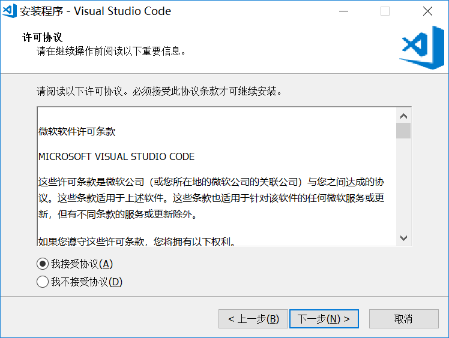
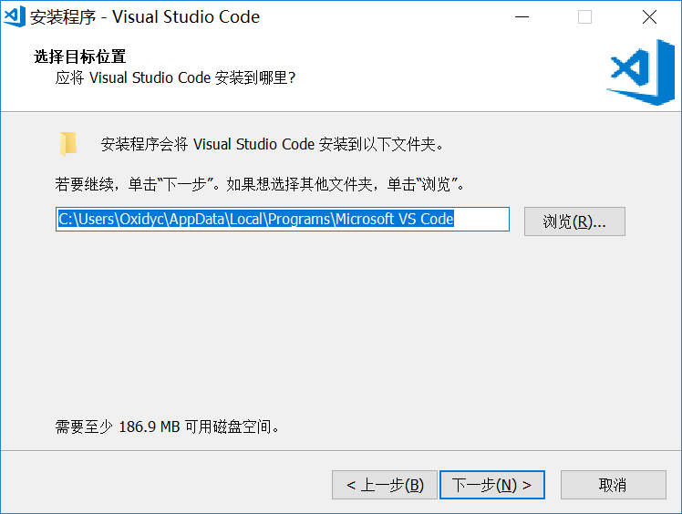
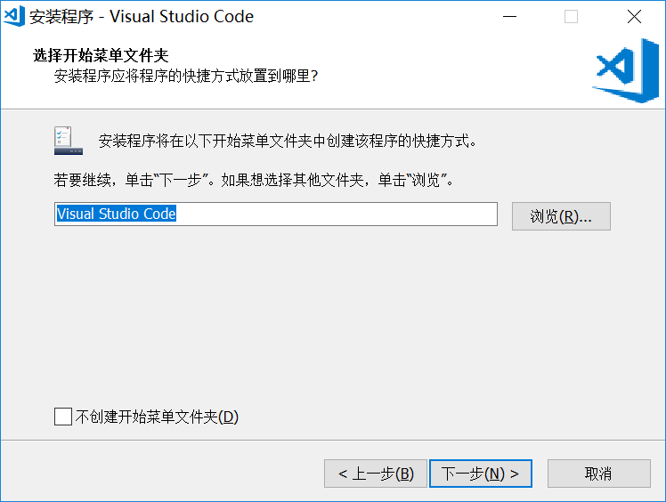
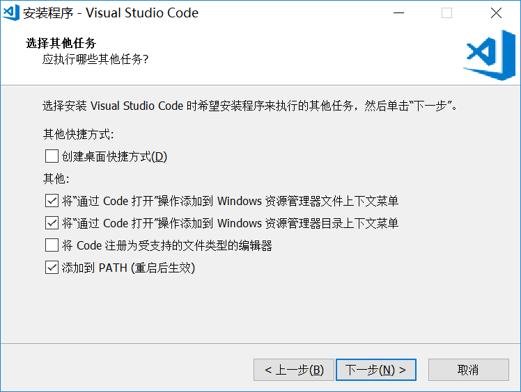
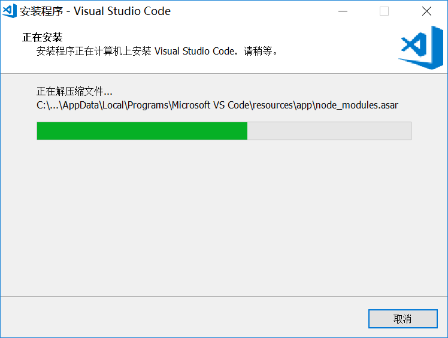

# Visual Studio Code Tutorial

## Introduce

Home:https://code.visualstudio.com/
## Download
地址1：https://code.visualstudio.com/docs/?dv=win64user

地址2：https://aka.ms/win32-x64-user-stable

本文基于`v1.30.0`版本，下载地址：
https://vscode.cdn.azure.cn/stable/c6e592b2b5770e40a98cb9c2715a8ef89aec3d74/VSCodeUserSetup-x64-1.30.0.exe

## Installation Steps
1. 安装向导

2. 许可协议

3. 选择目标位置

4. 选择开始菜单文件夹

5. 选择其他任务

复选资源管理器文件/目录上下文菜单

6. 安装准备就绪

7. 正在安装

8. 完成安装

## Settings
1. 设置

修改 `settings.json`
```json
{
    // 控制字体系列。默认为 Consolas, 'Courier New', monospace
    "editor.fontFamily": "PingFang SC, Fira Code Light, Consolas, 'Courier New', monospace",
    //设置主题样式
    "workbench.colorTheme": "One Dark Pro Vivid",
    //设置字体，默认12
    "editor.fontSize": 16,
    //设置自动保存，默认off
    "files.autoSave": "onFocusChange"
}
```
  - 中文语言环境设置：

    操作步骤：快捷键`Ctrl + Shift + P` -> `Configure Display Language` ( `配置显示语言`) -> `en` 改为 `zh-CN` -> 保存 `locale.json` -> 扩展中搜索出品自Microsoft的 `Chinese (Simplified) Language Pack for Visual Studio Code` -->安装扩展->重启VSCode

 修改 `locale.json`
```json
{
    "locale":"zh-CN"
}
```

2. 安装插件
    - Dracule Official （Dracula Theme）：主题包（可选安装）
    - One Dark Pro （binaryify）：主题包（可选安装）
    - HTML CSS Support （ecmel）：智能提示
    - ESLint （Dirk Baeumer）：代码检测工具
    - Chinese (Simplified) Language Pack for Visual Studio Code （Microsoft）：简体中文语言包
    - Vetur（Pine Wu）：vue.js 高亮插件（vue开发必选）
## Resource